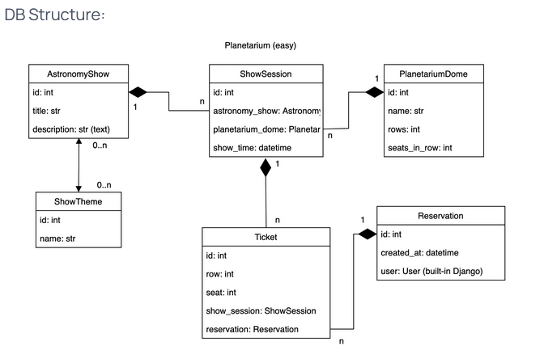
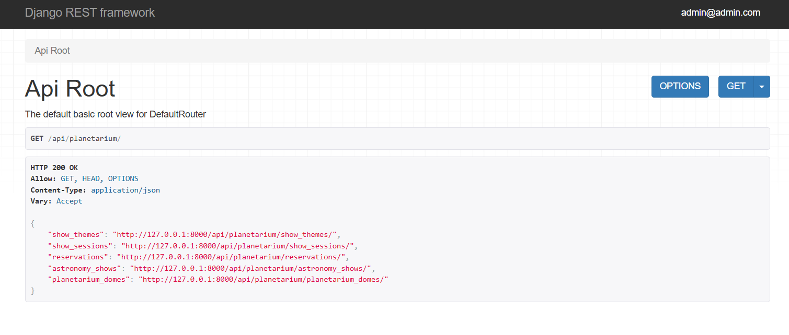

# **Planetarium API service**

DRF project for managing planetarium.

## **Installation** :
#### # Clone the repository
- git clone https://github.com/alexgubarev88/planetarium_api_service.git

#### # Set up .env file
- You have created .env using .env.sample. like example

#### # Build docker-compose container
- docker-compose build

#### Run docker compose
- docker-compose up

#### Go into docker-container
- docker exec -it <container id> sh

#### Create superuser
- python manage.py createsuperuser

#### Check it out
 - http://localhost:8000/api/planetarium/

# **Features:** 

 - JWT authenticated.
 - Admin panel.
 - Documentation for views(go to api/schema/swagger-ui/).
 - CRUD implementation for planetarium.
 - Filtering for astronomy show.

# Contact

**For contact me:**

 - _Fullname_: Oleksandr Gubarev

 - _Email_: [alexgubarev885@gmail.com]()

